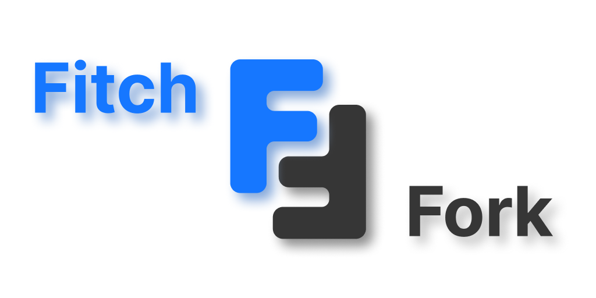

# 

**Advanced FitchFork**
_Developed by Team OWCA for COS 301 Capstone Project_

---

## Project Overview

**Advanced FitchFork** is a modular, extensible system for managing programming assignments, grading scripts, code execution, AI-powered diagnostics, and progress tracking. It provides a complete academic toolkit for tutors and administrators, with an intuitive interface and modern role-based access.

This project is developed for the COS 301 Capstone Project at the University of Pretoria in collaboration with the Computer Science Department of University of Pretoria.

[](https://codecov.io/gh/COS301-SE-2025/Advanced-FitchFork)
[](https://github.com/COS301-SE-2025/Advanced-FitchFork/actions)
[](https://shields.io/)
[](https://github.com/COS301-SE-2025/Advanced-FitchFork/issues)


**Core Functional Highlights:**

- Authentication with role-based access (Admin, Tutor, Student)
- Module and assignment management
- GATLAM and RNG-based marking scripts
- AI-generated summaries
- Containerized code execution
- Plagiarism detection and statistics
- Gamification and grading system

---

## Key Features

Please refer to our detailed [Functional and Non-Functional Requirements](#additional-resources) section below.

---

## Meet the Team

| Member           | Role(s)                             | Skills                                    | GitHub / LinkedIn                                                                                             |
| ---------------- | ----------------------------------- | ----------------------------------------- | ------------------------------------------------------------------------------------------------------------- |
| Jacques Klooster | Team Lead, Fullstack Dev            | React, Rust, Tailwind, SQLite, Ant Design | [GitHub](https://github.com/jacqu3sk) [LinkedIn](https://www.linkedin.com/in/jacquesklooster/)                |
| Reece Jordaan    | DevOps, Backend Developer           | Restful APIs, Rust, Testing               | [GitHub](https://github.com/ReeceJordaan) [LinkedIn](https://www.linkedin.com/in/reecejordaan/)               |
| Luke Gouws       | Backend/Frontend                    | Restful APIs, Rust, React                 | [GitHub](https://github.com/CartographySilence) [LinkedIn](https://www.linkedin.com/in/luke-gouws-4b07b7300/) |
| Richard Kruse    | Business Analyst, Backend Developer | Rust, Docker, SQLite                      | [GitHub](https://github.com/RKruse42) [LinkedIn](https://www.linkedin.com/in/richard-kruse/)                  |
| Aidan McKenzie   | Backend/Frontend                    | Rust, Figma                               | [GitHub](https://github.com/RaiderRoss) [LinkedIn](https://www.linkedin.com/in/aidan-mckenzie-772730355/)     |

---

## Tech Stack

| Tool        | Logo                                                  | Used For                                          |
| ----------- | ----------------------------------------------------- | ------------------------------------------------- |
| TypeScript  |  | Frontend logic and type safety                    |
| Rust        |              | Backend API and core logic                        |
| TailwindCSS |      | Styling the UI with utility-first CSS             |
| Ant Design  |              | UI components (tables, buttons, layouts)          |
| Vite        |              | Fast frontend bundler and dev server              |
| SQLite      |          | Lightweight database for storing application data |
| Docker      |          | Containerized code execution and deployment       |
| Jest        |              | Unit testing for frontend logic                   |
| Cypress     |        | End-to-end testing of frontend                    |
| React       |             | Frontend component-based UI framework             |

---

## Project Structure

```bash
advanced-fitch-fork/
├── backend/           # Rust backend (api, db, common, docker examples)
├── frontend/          # React frontend (UI, routing, services)
├── .github/           # GitHub workflows (CI)
├── docs/              # Requirements and documentation
├── README.md          # Project documentation
```

Detailed submodules exist for `auth`, `assignments`, `modules`, `users`, and interpreters.

---

## Getting Started

### Prerequisites

- Node.js (LTS)
- Rust (stable)
- Docker
- cargo-make

### Clone & Setup

```bash
git clone https://github.com/your-org/advanced-fitch-fork.git
cd advanced-fitch-fork
```

#### Frontend

```bash
cd frontend
npm install
npm run dev
```

#### Backend

```bash
cd backend
cp .env.example .env
docker build -t universal-runner .
cargo make fresh
cargo make api
```

> **Note:** This project uses [`cargo-make`](https://sagiegurari.github.io/cargo-make/).  
> Make sure to install it first with:
>
> ```bash
> cargo install cargo-make
> ```

---

## Running Tests

```bash
# Frontend unit tests
cd frontend
npm test

# Backend unit/integration tests
cd backend
cargo test
```

---

## Git Strategy

- `main`: Production-ready
- `dev`: Latest integration
- `feature/*`: In-progress features

> Pull requests require at least 1 approval.

---

## 💌 Contact

- Email: [owcaheadquarters@protonmail.com](mailto:owcaheadquarters@protonmail.com)
- Course: COS 301, University of Pretoria

---

## Additional Resources

| Resource                                                                          | Demo 1                                             | Demo 2                                             |
| --------------------------------------------------------------------------------- | -------------------------------------------------- | -------------------------------------------------- |
| **[Project Board (GitHub)](https://github.com/orgs/COS301-SE-2025/projects/199)** | —                                                  | —                                                  |
| **Domain Model Diagram**                                                          | [View](./docs/demo1/domain_model.png)              | [View](./docs/demo2/domain_model.png)              |
| **User Stories**                                                                  | [View](./docs/demo1/user_stories.pdf)              | [View](./docs/demo2/user_stories.pdf)              |
| **Use Cases**                                                                     | [View](./docs/demo1/use_cases.pdf)                 | [View](./docs/demo2/use_cases.pdf)                 |
| **Software Requirements Specification (SRS)**                                     | [View](./docs/demo1/srs.pdf)                       | [View](./docs/demo2/srs.pdf)                       |
| **Functional and Non-Functional Requirements Summary**                            | [View](./docs/demo1/requirement_specification.pdf) | [View](./docs/demo2/requirement_specification.pdf) |
| **User Manual**                                                                   | —                                                  | [View](./docs/demo2/user_manual.pdf)               |
| **Code Standards**                                                                | —                                                  | [View](./docs/demo2/code_standards.pdf)            |

---

## Viewing Internal Rust Documentation

To browse the backend's internal API documentation (generated with `rustdoc`), follow these steps:

```bash
cd backend
cargo doc --open
```

This will generate and open the documentation in your default web browser. It includes all public modules, functions, and type definitions used throughout the backend.

> Ensure you have Rust installed and configured properly before running the above command.

---

## Demo Video Links

- **[Demo 2](https://drive.google.com/file/d/1HH14M2B5bdTDQUfJQkwJvmMiMGzrWq66/view?usp=sharing)**

---

© 2025 Team OWCA. All rights reserved.
